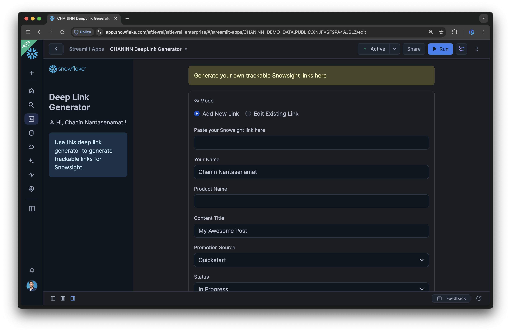
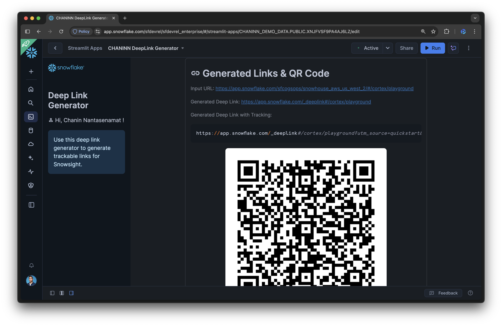

# Deep Link Generator

This app generates trackable Snowsight links.

<table width="100%">
  <thead>
    <tr>
      <th width="50%">Initial state</th>
      <th width="50%">Link generation state</th>
    </tr>
  </thead>
  <tbody>
    <tr>
      <td></td>
      <td></td>
    </tr>
  </tbody>
</table>

In a nutshell, we're building this app in Python with Streamlit on the Snowflake platform.

## Setup
We're setting up the project by first creating databases, ingesting the data and finally followed by creating the Streamlit app.

### Create database and table

```sql
-- 1. Create Database
-- This statement creates a new database called DEEPLINK_DB.
CREATE OR REPLACE DATABASE DEEPLINK_DB;

-- 2. Create Table
-- This statement creates the DEEPLINK_DATA_LOG table with the new timestamp columns.
-- The DEFAULT CURRENT_TIMESTAMP() clause automatically sets these fields on creation.
CREATE OR REPLACE TABLE DEEPLINK_DB.PUBLIC.DEEPLINK_DATA_LOG (
    LOG_ID INT AUTOINCREMENT PRIMARY KEY,
    NAME VARCHAR(255),
    PRODUCT VARCHAR(255),
    INPUT_URL VARCHAR(2048),
    GENERATED_DEEPLINK VARCHAR(2048),
    STATUS VARCHAR(100),
    CONTENT_TITLE VARCHAR(500),
    SOURCE VARCHAR(100),
    TRACKING_URL VARCHAR(2048),
    CREATION_DATE TIMESTAMP_NTZ DEFAULT CURRENT_TIMESTAMP(),
    LAST_UPDATED_DATE TIMESTAMP_NTZ DEFAULT CURRENT_TIMESTAMP()
);

-- 3. Populate table with data
-- This single INSERT statement will populate your new table with the initial records.
-- The new date columns will be filled automatically by the database.
INSERT INTO DEEPLINK_DB.PUBLIC.DEEPLINK_DATA_LOG 
    (NAME, PRODUCT, INPUT_URL, GENERATED_DEEPLINK, STATUS, CONTENT_TITLE, SOURCE, TRACKING_URL) 
VALUES 
    ('Example Example', 'Notepads', 'https://app.snowflake.com/_deeplink/#/notepads', 'https://app.snowflake.com/_deeplink/#/notepads', 'In Progress', 'Example Title', 'Quickstart', 'https://app.snowflake.com/_deeplink/#/notepads?utm_source=quickstart&utm_medium=quickstart&utm_campaign=-us-en-all&utm_content=app-example-title')
```

### Query data

```sql
-- Query table
SELECT * FROM DEEPLINK_DB.PUBLIC.DEEPLINK_DATA_LOG;
```

### Create Streamlit app

Now that the database and table are ready, we can go ahead and spin up a Streamlit in Snowflake app.

Ensure that you have the following prerequisite libraries installed:
```bash
qrcode
snowflake-snowpark-python
```

Next, copy/paste the contents from [`streamlit_app.py`](streamlit_app.py) into the left code panel of Snowsight.

